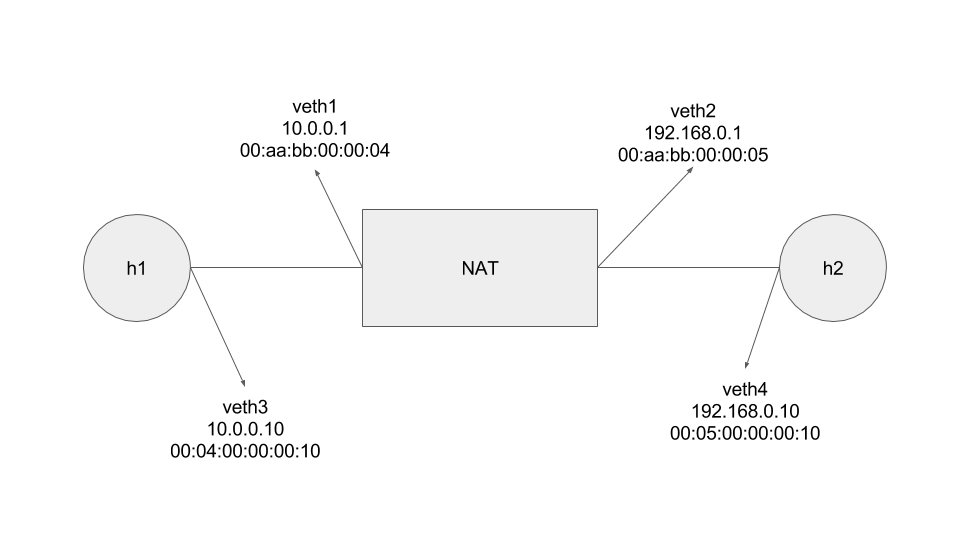

## Introduction to Experiment

This experiment is a simpler version of simple_nat program in https://github.com/p4lang/tutorials/tree/master/examples/simple_nat .

Network topology is shown in the following picture:



NAT behavior in nutshell:

1. External packets with destination IP `192.168.0.1` and source port `[0,59]`, will be changed to destination IP `10.0.0.10` (source port remains unchanged).

2. Internal packets with source IP `10.0.0.10` and destination port `[0,59]`, will be changed to source IP `192.168.0.1` (destination port remains unchanged).

3. Otherwise drop packets.

## Experiment Method

#### 1. set up virtual network topology
```
bash setup.s
```

#### 2. compile p4 source program
```
bash compile.sh
```

#### 3. launch switch with bmv2 model
```
bash start.sh
```

#### 4. populate entry to table
```
bash populate.sh
```

#### 5. send tcp ping packets and get latency
```
bash latency.sh
```

#### 6. analyze latency
```
python3 latency.py
```

## Experiment Result

#### On my Acer notebook
| cache| max latency(ms) | min latency(ms) | average latency(ms) |
| :--: | :---: | :---: | :---: |
| N | 1.042 | 0.618 | 0.9080 |
| Y | 0.923 | 0.527 | 0.7768 |
| $\uparrow$ | 11.4% | 14.7% | 14.4% |

$$ \uparrow \; = \frac{N - Y}{N} * 100\% $$
